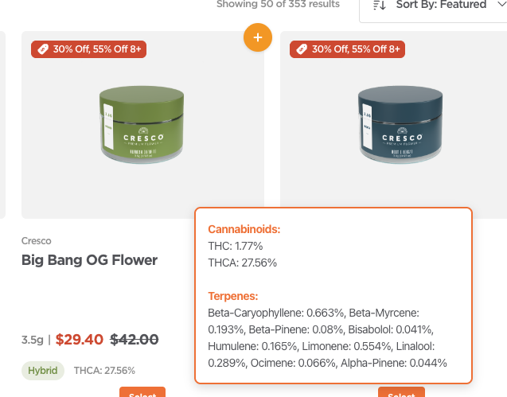
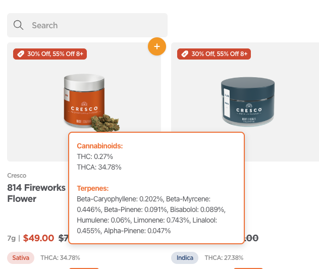
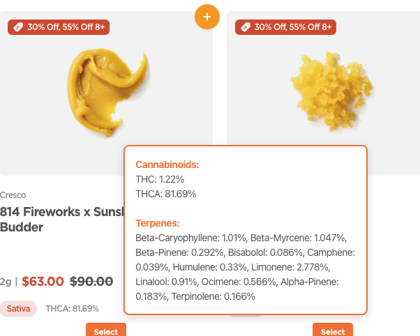
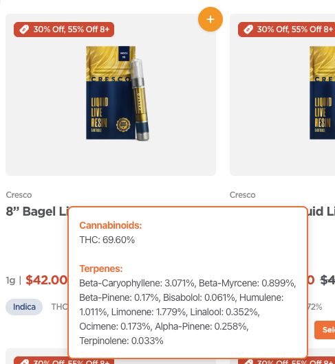
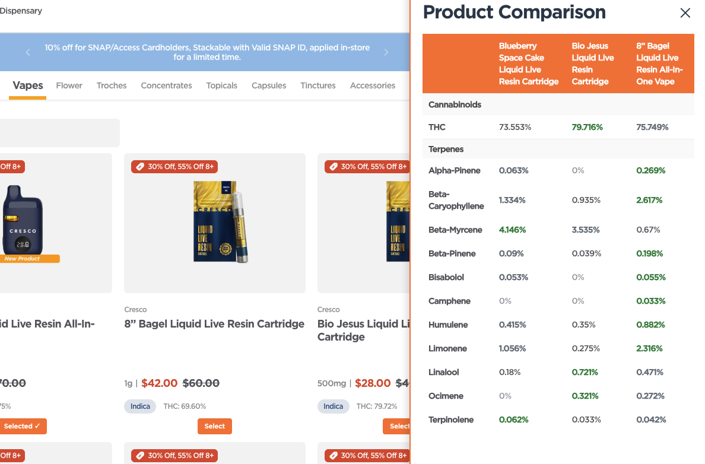
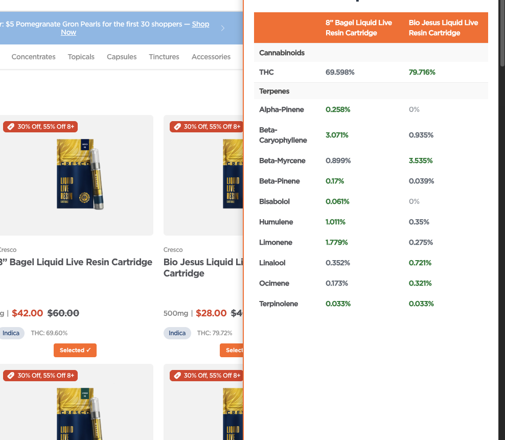
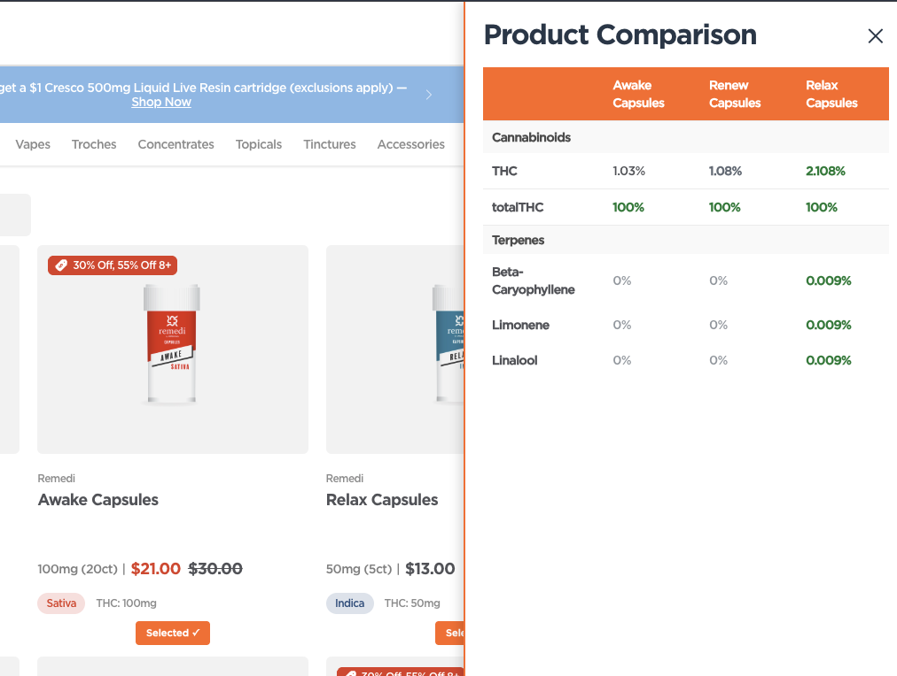

# CannabisSage

Chrome extension (Manifest V3) that enhances [Sunnyside](https://www.sunnyside.shop) product listing pages with cannabinoid and terpene details on hover, plus side-by-side comparison of up to three selected products.

Cannabinoid and terpene figures on many cannabis ecommerce listings are incomplete or only visible after opening each product page. CannabisSage surfaces retailer-provided profile data on the listing grid so you can scan and compare without extra navigation.

> This extension displays information published by Sunnyside. It does **not** provide medical advice and does not make claims about effects, dosing, or treatment outcomes.

## Features

- **Hover tooltips** — cannabinoid percentages (THC, THCA, CBD, CBDA, and related fields when present) and terpene details when available
- **Select up to 3 products** — orange **Select** control on product cards
- **Compare sidebar** — side-by-side cannabinoid and terpene table with simple highlighting of higher values
- **On-demand fetch** — when listing cards lack detail, the extension fetches the matching Sunnyside product page through a background service worker (no remote code execution)

## Install (Chrome — primary)

### Load unpacked (development)

1. Open `chrome://extensions`
2. Enable **Developer mode**
3. Click **Load unpacked**
4. Select the `extension/` folder from this repository
5. Open a Sunnyside listing such as [Flower](https://www.sunnyside.shop/products/flower) or [Vapes](https://www.sunnyside.shop/products/vapes)

### Chrome Web Store

When published, install from the Chrome Web Store listing. Until then, use **Load unpacked** above. Packaging and store copy live in [`STORE_LISTING.md`](STORE_LISTING.md).

### Pack a zip for upload

```bash
./scripts/pack-extension.sh
```

Creates `dist/cannabis-sage-<version>.zip` ready for the developer dashboard.

## Usage

1. Go to a supported listing: `https://www.sunnyside.shop/products/<category>`
2. Hover a product card to load available profile details
3. Click **Select** on up to three products
4. Click **Compare (N)** (bottom-right) to open the sidebar
5. Close the sidebar with **✕**

## Screenshots

Screenshots under [`screenshots/`](screenshots/) show the earlier userscript UX on Sunnyside (tooltips and comparison). Resize to Chrome Web Store sizes (**1280×800** and **640×400**) before store submission — see [`STORE_LISTING.md`](STORE_LISTING.md).

### Hover tooltips









### Product comparison







## Permissions

| Declaration | Purpose |
| --- | --- |
| Host access to `https://www.sunnyside.shop/*` (and apex) | Run on listing pages and fetch product detail HTML on the same site |
| No `storage` / `tabs` / `cookies` / `<all_urls>` | Kept intentionally unused |

Full privacy details: [`PRIVACY.md`](PRIVACY.md).

## Debugging

Debug logging is **off** by default. To enable on a tab:

```js
localStorage.setItem('cannabisSageDebug', '1');
location.reload();
```

Or append `?cannabisSageDebug=1` to the listing URL. A small version badge appears briefly when debug mode is on.

## File structure

```
CannabisSage/
├── extension/                 # Load this folder as an unpacked MV3 extension
│   ├── manifest.json
│   ├── background.js          # Service worker: same-origin product HTML fetch
│   ├── content.js             # Listing UI: tooltips, select, compare
│   ├── content.css
│   └── icons/                 # 16 / 48 / 128
├── scripts/pack-extension.sh  # Build store zip → dist/
├── PRIVACY.md
├── STORE_LISTING.md
├── screenshots/               # Docs / store reference images
├── legacy/                    # Former Tampermonkey userscript (unsupported)
└── README.md
```

## Legacy Tampermonkey script

The original POC userscript is preserved under [`legacy/`](legacy/) for reference. Prefer the Chrome extension. The userscript used `GM_xmlhttpRequest`; the extension replaces that with `chrome.runtime` messaging to a service worker and precise `host_permissions`.

## Limitations

- Supported retailer in this release: **Sunnyside only**
- Profile completeness depends on what Sunnyside publishes; some SKUs omit terpene breakdowns
- Site DOM or routing changes may require selector updates
- Listing pages are a client-rendered SPA; the extension watches DOM mutations and history navigation within `/products/*`

## License

Personal / educational project. Use at your own discretion and in line with Sunnyside’s terms and local law.

## Support

1. Confirm the extension is enabled on `chrome://extensions`
2. Confirm the URL matches `https://www.sunnyside.shop/products/...`
3. Open DevTools → Console (enable debug mode if needed)
4. Refresh after Sunnyside finishes rendering the product grid
