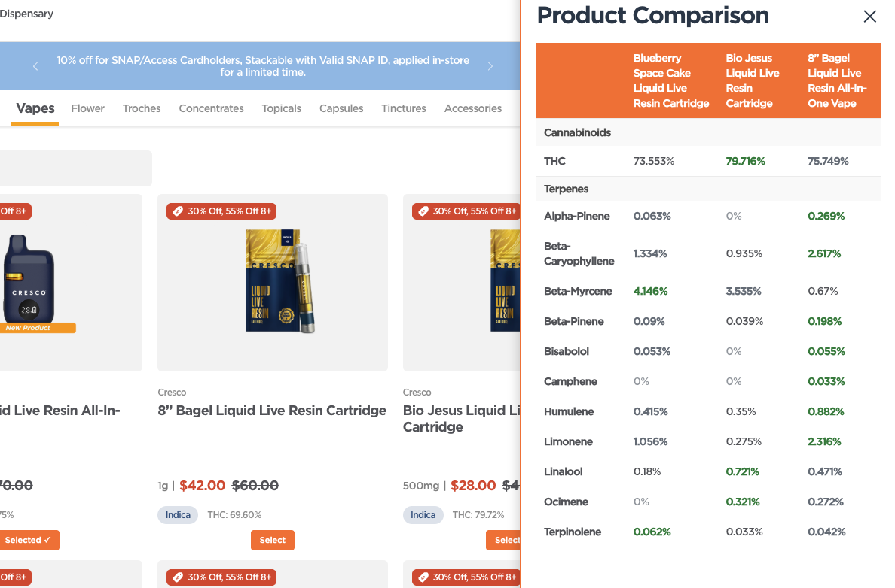

# Cannabis Sage - Product Insights Enhancement

A Tampermonkey userscript that enhances cannabis ecommerce product listing pages by displaying detailed terpene and cannabinoid profiles on hover, and enabling side-by-side comparison of up to 3 selected products.

**Why This Matters**: Cannabinoid and terpene information is critical for making informed purchasing decisions, yet many cannabis ecommerce sites leave this essential data buried in product detail pages or completely hidden. This script brings this vital information directly to product listings where consumers need it most.

## Features

- **Hover Tooltips**: Hover over any product card to see its cannabinoid profile (THC, THCA, CBD, CBDa) and terpene list
- **Product Selection**: Click "Select" on up to 3 products to add them to comparison
- **Side-by-Side Comparison**: Click the "Compare" button to view selected products in a comparison sidebar
- **Real-time Data**: Fetches fresh product data from detail pages on demand

## Screenshots

### Hover Tooltips

Hover over any product card to instantly see detailed cannabinoid and terpene profiles:


*Hover tooltip showing cannabinoid and terpene breakdown for flower product (THC: 1.77%, THCA: 27.56%)*


*Hover tooltip showing detailed terpene profile for flower product (THCA: 34.78%)*


*Hover tooltip displaying cannabinoid and terpene information for concentrate product (THCA: 81.69%)*


*Vape cartridge hover tooltip showing cannabinoid profile for liquid live resin product (THC: 69.60%)*

### Product Comparison

Select up to 3 products and compare them side-by-side:



*Side-by-side comparison of three vape products with highlighted differences in cannabinoid and terpene profiles*


*Comparing two vape products with detailed cannabinoid and terpene profiles side-by-side*


*Capsule product comparison showing three different capsules with cannabinoid and terpene variations*

## Installation

1. **Install Tampermonkey Extension**
   - Chrome: [Tampermonkey Chrome Extension](https://chrome.google.com/webstore/detail/tampermonkey/dhdgffkkebhmkfjojejmpbldmpobfkfo)
   - Firefox: [Tampermonkey Firefox Add-on](https://addons.mozilla.org/en-US/firefox/addon/tampermonkey/)
   - Edge: [Tampermonkey Edge Extension](https://microsoftedge.microsoft.com/addons/detail/tampermonkey/iikmkjmpaadaobahmlepeloendndfphd)

2. **Install the Script**
   - Click the Tampermonkey icon in your browser toolbar
   - Select "Create a new script..."
   - Delete the default template code
   - Copy and paste the entire contents of `sunnyside-insights.user.js`
   - Press `Ctrl+S` (Windows/Linux) or `Cmd+S` (Mac) to save

3. **Enable the Script**
   - The script should be enabled by default
   - Navigate to any supported cannabis ecommerce site's product listing page
   - The script will automatically activate on compatible product listing pages

## Usage

### Viewing Product Insights

1. Navigate to any supported cannabis ecommerce site's product listing page
2. Hover your mouse over any product card
3. A tooltip will appear showing:
   - **Cannabinoids**: THC, THCA, CBD, CBDa percentages
   - **Terpenes**: List of terpenes (e.g., Myrcene, Caryophyllene, Limonene, Linalool)
   
   This information is often missing or hard to find on product listing pages, making it difficult to compare products without clicking through to each individual product page.

### Comparing Products

1. **Select Products**: Click the orange "Select" button on up to 3 product cards
   - Selected products will show "Selected ✓" in green
   - Maximum of 3 products can be selected at once

2. **Open Comparison**: Click the "Compare (X)" button in the bottom-right corner
   - X shows the number of selected products
   - A sidebar will slide in from the right

3. **View Comparison**: The sidebar displays a comparison table with:
   - Product names in the header
   - Cannabinoid profiles side-by-side
   - Terpene lists for each product

4. **Close Comparison**: Click the "✕" button in the top-right of the sidebar

## Technical Details

### How It Works

- **Product Detection**: The script identifies product cards using the selector `ul[role="region"] li button`
- **URL Extraction**: Multiple methods are used to extract product URLs:
  - Looking for `<a>` tags with product links
  - Checking data attributes
  - Parsing onclick handlers
  - Intercepting clicks to cache URLs
- **Data Fetching**: Uses `GM_xmlhttpRequest` to fetch product detail pages without CORS restrictions
- **Data Parsing**: Extracts cannabinoid percentages and terpene names from the HTML using DOM queries
- **Dynamic Updates**: Uses `MutationObserver` to handle dynamically loaded products (e.g., infinite scroll)

### Browser Compatibility

- ✅ Chrome/Chromium-based browsers (Chrome, Edge, Brave, etc.)
- ✅ Firefox
- ✅ Safari (with Tampermonkey)

### Limitations

- **No Caching**: Product data is fetched fresh on each hover (as per POC requirements)
- **Product URL Detection**: Some products may require a click before hover works (URL gets cached)
- **Rate Limiting**: Respects the website's rate limits - don't hover rapidly across many products
- **Structure Changes**: If sites update their HTML structure, selectors may need adjustment
- **Site-Specific**: Each cannabis ecommerce site may require custom configuration for optimal compatibility

## Troubleshooting

### Tooltip Not Appearing

- **Check Script Status**: Click Tampermonkey icon → Ensure script is enabled
- **Check Page URL**: Script only works on compatible product listing pages
- **Check Console**: Open browser DevTools (F12) → Console tab → Look for errors
- **Try Clicking First**: Some products may need one click to cache the URL before hover works
- **Site Compatibility**: Ensure the site is supported - some sites may require custom configuration

### Product Selection Not Working

- **Maximum Reached**: Only 3 products can be selected at once. Deselect one first.
- **Button Not Visible**: Scroll to see all product cards - selection buttons are added dynamically

### Comparison Sidebar Not Loading

- **No Products Selected**: Select at least one product first
- **Slow Network**: Product data fetching may take a few seconds - wait for "Loading..." to complete
- **Check Console**: Look for fetch errors in the browser console

### Data Not Showing

- **Product Out of Stock**: Some products may not have complete data
- **Missing Fields**: Some products may not have all cannabinoids or terpenes listed
- **Parse Errors**: Check console for parsing errors if data structure changed

## Development

### File Structure

```
CannabisSage/
├── sunnyside-insights.user.js  # Main Tampermonkey script
├── test-script.user.js         # Test/development script
├── README.md                    # This file
├── .gitignore                   # Git ignore rules
└── screenshots/                 # Screenshot images for documentation
    ├── image.png               # Flower hover tooltip example
    ├── 2.png                   # Flower hover tooltip example
    ├── 3.png                   # Concentrate hover tooltip example
    ├── 4.png                   # Vape hover tooltip example
    ├── 5.png                   # Vape comparison (3 products)
    ├── 6.png                   # Vape comparison (2 products)
    └── 7.png                   # Capsule comparison (3 products)
```

### Customization

To modify the script:

1. Open Tampermonkey dashboard (click icon → Dashboard)
2. Find the script name (may vary based on script header)
3. Click the script name to edit
4. Make your changes
5. Save (Ctrl+S / Cmd+S)

### Common Customizations

- **Change Maximum Products**: Edit `selectedProducts.length >= 3` to change limit
- **Modify Tooltip Style**: Edit CSS in `createTooltip()` function
- **Add More Cannabinoids**: Extend the regex patterns in `fetchProductDetails()`
- **Change Colors**: Modify color constants to match your preferred theme
- **Add Site Support**: Update selectors and URL patterns to support additional cannabis ecommerce sites

## Notes

- This is a **Proof of Concept** - not production-ready code
- No data caching is implemented (fetches on every hover)
- Respects the website's Terms of Service
- For personal/educational use only

## Future Enhancements

Potential improvements for future versions:

- [ ] Add data caching to reduce server requests
- [ ] Support for other product types (Vapes, Edibles, etc.)
- [ ] Export comparison data to CSV/JSON
- [ ] Filter products by terpene/cannabinoid ranges
- [ ] Persistent selection (save selected products across sessions)
- [ ] Better error messages and retry logic
- [ ] Mobile-friendly tooltip positioning

## License

This is a personal project for educational purposes. Use at your own discretion.

## Support

If you encounter issues:

1. Check the browser console for errors
2. Verify the script is enabled in Tampermonkey
3. Ensure you're on a compatible product listing page
4. Try refreshing the page
5. Verify the site structure matches expected patterns

---

**Enjoy making informed cannabis purchases with enhanced product insights! 🌿**

**Remember**: Cannabinoid and terpene profiles are essential information that should be easily accessible when shopping. This script helps bridge the gap where ecommerce sites fail to surface this critical data on product listing pages.

